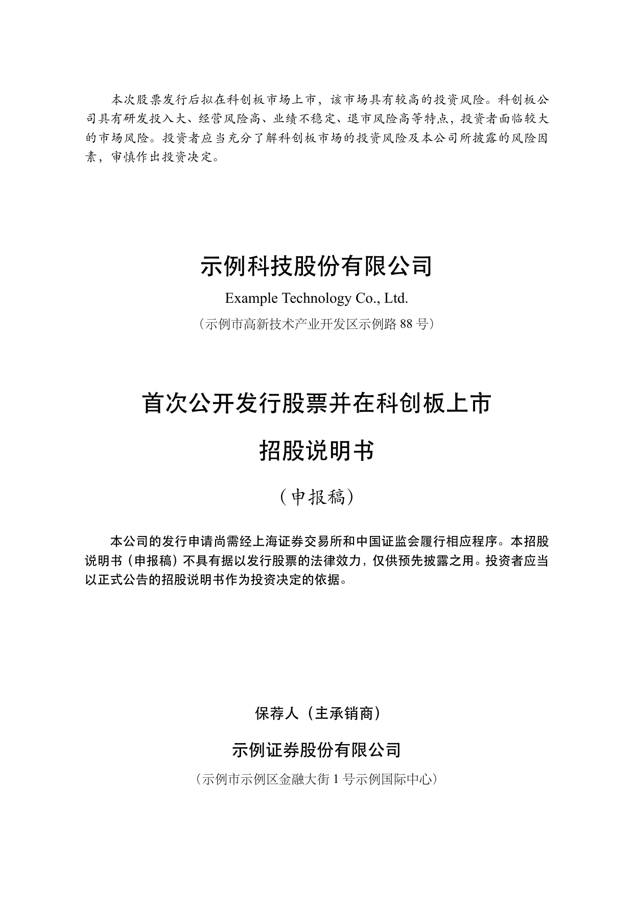
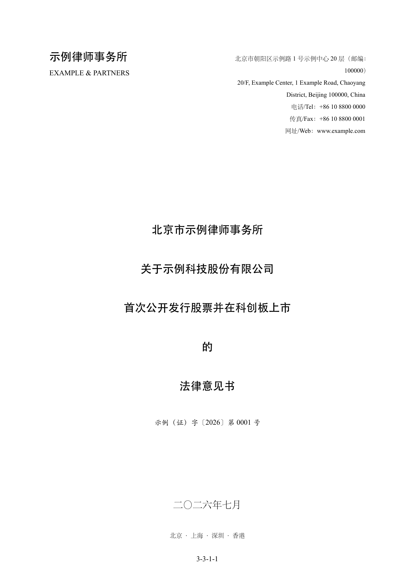
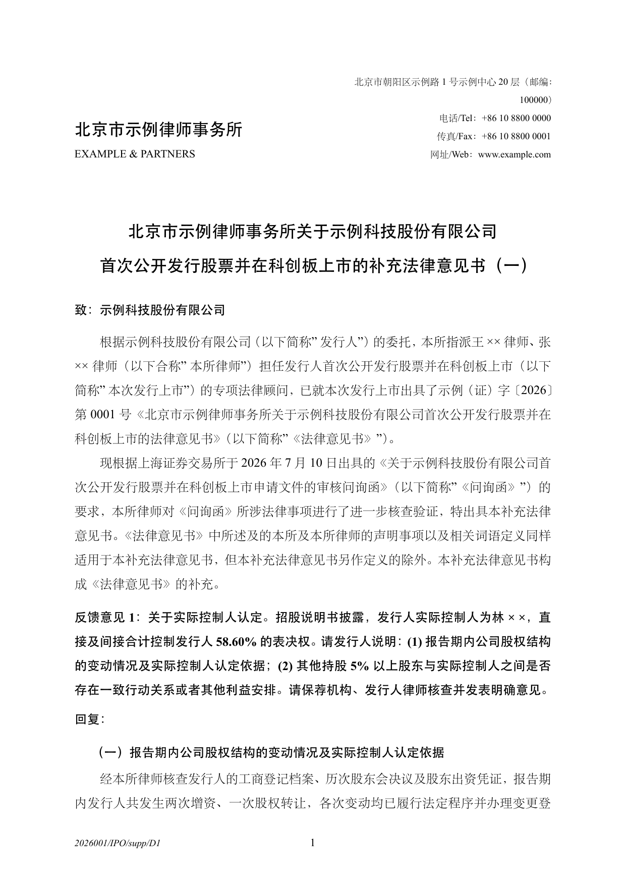
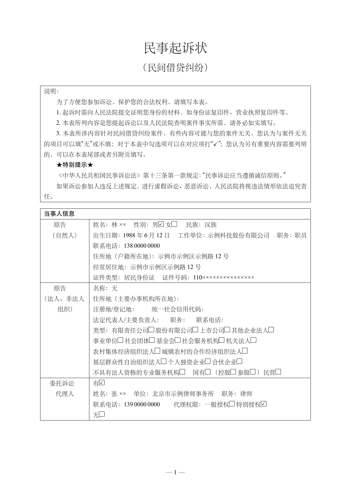
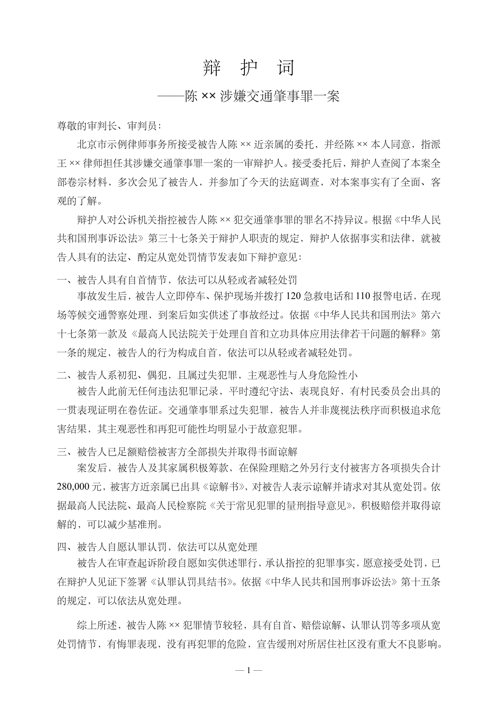
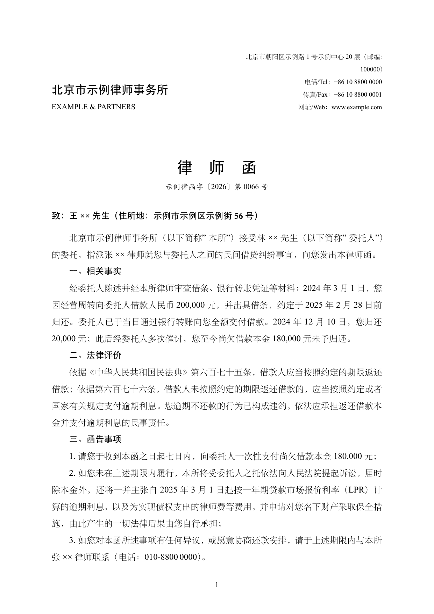

# skills-latex

Kirk Lin's LaTeX skill for AI agents — curated, compile-tested document templates
with a one-command PDF build. Describe a document; get a finished PDF. No LaTeX
wrangling required.

## Layout

| Path | What |
|---|---|
| [`SKILL.md`](SKILL.md) | Skill entry point (the agent reads this) |
| [`templates/`](templates/) | Self-contained document templates — start with `neurips-paper` |
| [`scripts/compile.sh`](scripts/compile.sh) | Build a `.tex` to PDF + PNG previews |
| [`references/`](references/) | Template catalog and the "add a template" guide |
| [`examples/`](examples/) | Rendered previews of each template |

## Build

```bash
bash scripts/compile.sh templates/neurips-paper/paper.tex --preview
```

Requires TeX Live (`pdflatex`/`xelatex`, `latexmk`) and `poppler-utils`
(`pdftoppm`) for previews.

## Templates

- **neurips-paper** — single-column NeurIPS/arXiv-style research paper. Two
  variants: pixel-faithful (real `nips_2017.sty`) and portable standalone.
- **cn-doc** — everyday Chinese document base（中式公文排版：黑体标题、
  「一、（一）1.」层级、首行缩进、落款）for 通知 / 报告 / 总结 / 请示 / 函 / 制度.
  The default for Chinese documents.
- **cn-gongwen** — 党政机关公文 per **GB/T 9704—2012**: 红色机关标志、发文字号、
  红线、版记、镜像页码, all hard spec dimensions pixel-verified; auto-detects
  方正小标宋/仿宋_GB2312 with graceful fallbacks. Five build files cover every
  layout in the standard: 文件式 (`main.tex`), 联合行文, 信函, 命令（令）, 纪要.
- **resume** — one-page Chinese professional resume in the classic
  structure（姓名区+证件照位、公司/职位/时间一行三列、「1、2、」编号要点、
  黑体强调、年.月 等宽数字对齐）; 宋黑搭配, all-black, single file, no
  external class. Sample recreates Elon Musk's public career.
- **cn-fagui** — 法律法规电子文件 per **GB/T 47229.1—2026**: 法规/司法解释
  正式发布文本的条文式排版（2号小标宋标题、楷体题注与目录、编/分编/章/节/条
  自动中文数字编号、款项目层级），页面底座与 GB/T 9704 同源。
  Sample: 《民法典》真实条文节选。
- **cn-ipo** — A股IPO招股说明书 per 证监会**信息披露准则第57号**（全面注册制）:
  封面/声明及承诺/致投资者声明/发行概况/十二节正文/签字页全要素，结构与措辞对照准则官方
  原文及真实科创板申报稿逐项校验；头部券商投行申报版式（黑体节标题、全线框
  财务表、「1-1-N」卷册页码、TikZ 股权结构图），治理结构按新《公司法》，
  示例财务数据内部勾稽一致。Sample: 虚构 AI 大模型公司科创板申报稿全套 67 页。
- **cn-legal-opinion** — 律所法律意见书 per **编报规则第 12 号**：版式综合
  八家头部律所公开披露文书逐页实测、各取所长（文号封面、双行页眉、三列全线框
  释义表、「一、（一）1、」层级、签章页公章钩子、「3-3-1-N」卷册页码），
  另含信函式补充法律意见书（信头＋问询回复体例）；差异点（之/的、经办/承办、
  卷册号/案号）做成开关。Sample: 与 cn-ipo 同一虚构示例公司的科创板 IPO
  法律意见书 10 页＋补充意见书 3 页＋律师函 2 页。
- **cn-litigation** — 诉讼与仲裁文书，覆盖民事/劳动/刑事：民事起诉状与
  答辩状按最高法、司法部、全国律协**法〔2025〕82 号**要素式示范文本
  （表格化、勾选式，含 2025 版新增的先行调解意愿栏）；劳动仲裁申请书按
  北京仲裁委官方表格；刑事辩护词按刑辩通行体例（受托段/分点意见/综上/
  落款）。四份文书同一虚构案件世界、金额自洽，勾选框自绘不依赖字体字位。

### Previews

Click any page to open the sample PDF.

<table>
  <tr>
    <td align="center"><a href="examples/neurips-paper/paper.pdf"></a><br><sub><b>neurips-paper</b></sub></td>
    <td align="center"><a href="examples/cn-doc/main.pdf"></a><br><sub><b>cn-doc</b></sub></td>
    <td align="center"><a href="examples/cn-gongwen/main.pdf"></a><br><sub><b>cn-gongwen</b></sub></td>
  </tr>
  <tr>
    <td align="center"><a href="examples/resume/main.pdf"></a><br><sub><b>resume</b></sub></td>
    <td align="center"><a href="examples/cn-fagui/main.pdf"></a><br><sub><b>cn-fagui</b></sub></td>
    <td align="center"><a href="examples/cn-gongwen/xinhan.pdf"></a><br><sub><b>cn-gongwen · 信函</b></sub></td>
  </tr>
  <tr>
    <td align="center"><a href="examples/cn-ipo/main.pdf"></a><br><sub><b>cn-ipo</b></sub></td>
    <td align="center"><a href="examples/cn-legal-opinion/main.pdf"></a><br><sub><b>cn-legal-opinion</b></sub></td>
    <td align="center"><a href="examples/cn-legal-opinion/supplemental.pdf"></a><br><sub><b>cn-legal-opinion · 补充意见书</b></sub></td>
  </tr>
  <tr>
    <td align="center"><a href="examples/cn-litigation/complaint.pdf"></a><br><sub><b>cn-litigation · 起诉状</b></sub></td>
    <td align="center"><a href="examples/cn-litigation/defense-statement.pdf"></a><br><sub><b>cn-litigation · 辩护词</b></sub></td>
    <td align="center"><a href="examples/cn-legal-opinion/demand-letter.pdf"></a><br><sub><b>cn-legal-opinion · 律师函</b></sub></td>
  </tr>
</table>

Adding your own → [`references/adding-templates.md`](references/adding-templates.md).

## Install as an agent skill

`SKILL.md` uses the open Agent Skill format, so it isn't tied to any one AI agent.
Place (or symlink) this repository wherever your agent loads skills from, as a
folder named `kirklin-latex` (matching the `name:` in `SKILL.md`).
