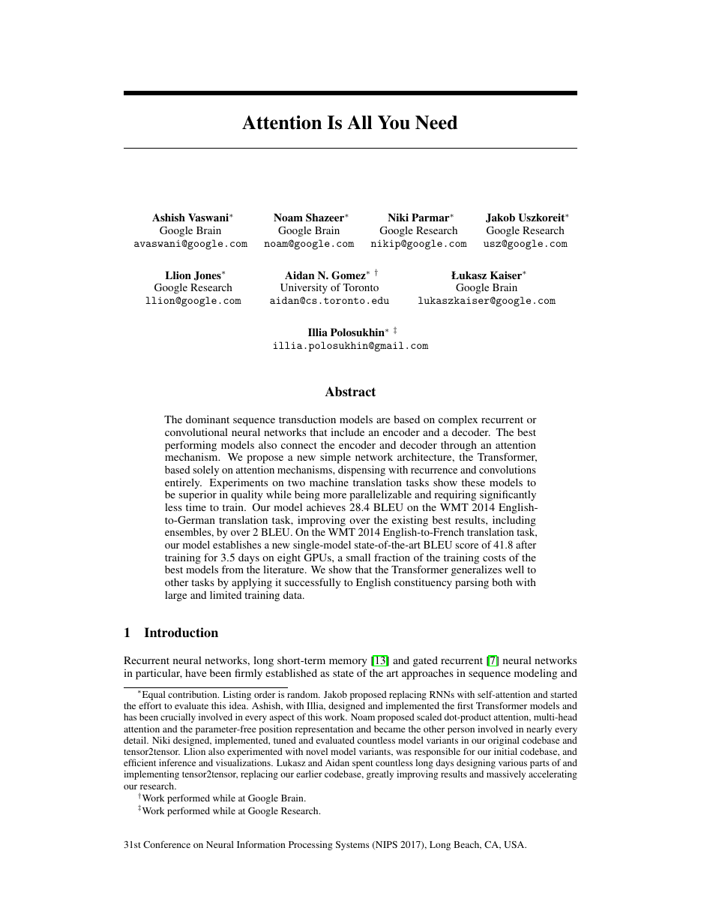
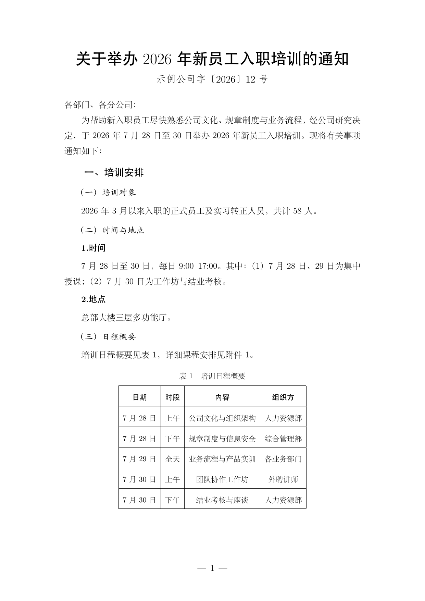
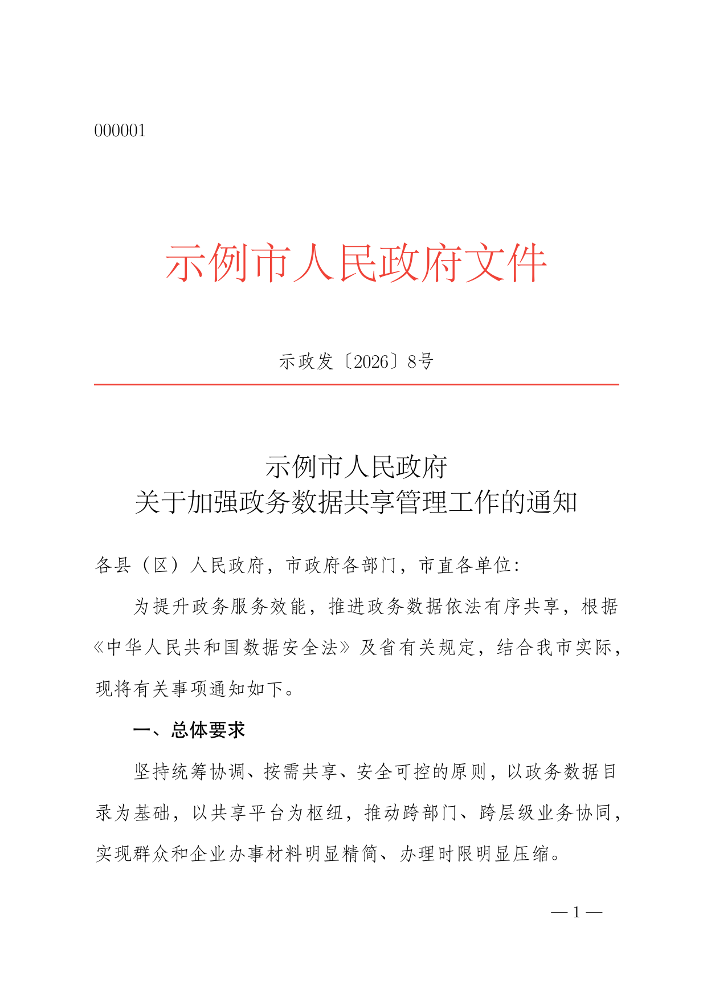
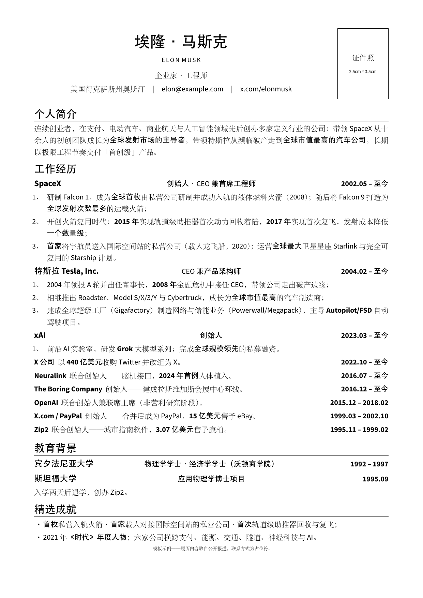
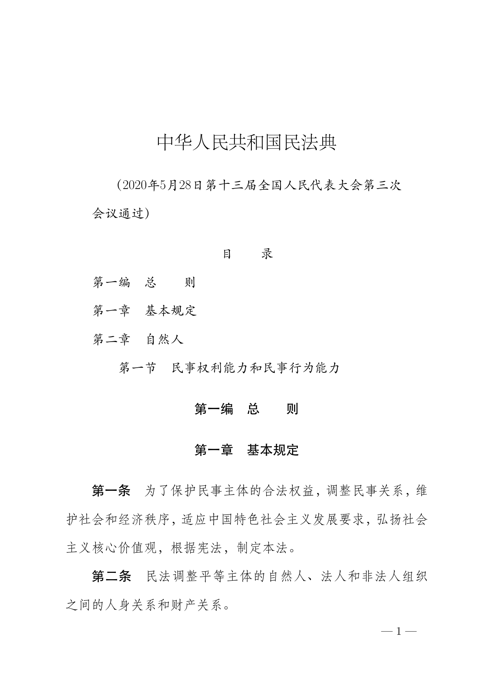
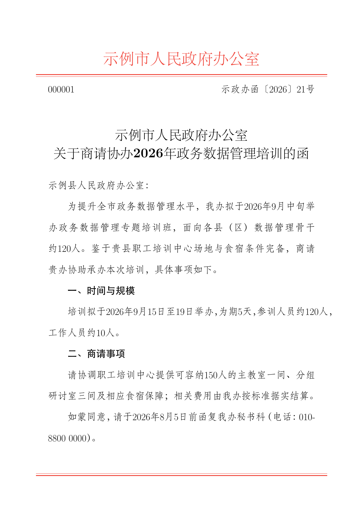

# skills-latex

Kirk Lin's LaTeX skill for AI agents — curated, compile-tested document templates
with a one-command PDF build. Describe a document; get a finished PDF. No LaTeX
wrangling required.

## Layout

| Path | What |
|---|---|
| [`SKILL.md`](SKILL.md) | Skill entry point (the agent reads this) |
| [`templates/`](templates/) | Self-contained document templates — start with `neurips-paper` |
| [`scripts/compile.sh`](scripts/compile.sh) | Build a `.tex` to PDF + PNG previews |
| [`references/`](references/) | Template catalog and the "add a template" guide |
| [`examples/`](examples/) | Rendered previews of each template |

## Build

```bash
bash scripts/compile.sh templates/neurips-paper/paper.tex --preview
```

Requires TeX Live (`pdflatex`/`xelatex`, `latexmk`) and `poppler-utils`
(`pdftoppm`) for previews.

## Templates

- **neurips-paper** — single-column NeurIPS/arXiv-style research paper. Two
  variants: pixel-faithful (real `nips_2017.sty`) and portable standalone.
- **cn-doc** — everyday Chinese document base（中式公文排版：黑体标题、
  「一、（一）1.」层级、首行缩进、落款）for 通知 / 报告 / 总结 / 请示 / 函 / 制度.
  The default for Chinese documents.
- **cn-gongwen** — 党政机关公文 per **GB/T 9704—2012**: 红色机关标志、发文字号、
  红线、版记、镜像页码, all hard spec dimensions pixel-verified; auto-detects
  方正小标宋/仿宋_GB2312 with graceful fallbacks. Five build files cover every
  layout in the standard: 文件式 (`main.tex`), 联合行文, 信函, 命令（令）, 纪要.
- **resume** — one-page Chinese professional resume in the classic
  structure（姓名区+证件照位、公司/职位/时间一行三列、「1、2、」编号要点、
  黑体强调、年.月 等宽数字对齐）; 宋黑搭配, all-black, single file, no
  external class. Sample recreates Elon Musk's public career.
- **cn-fagui** — 法律法规电子文件 per **GB/T 47229.1—2026**: 法规/司法解释
  正式发布文本的条文式排版（2号小标宋标题、楷体题注与目录、编/分编/章/节/条
  自动中文数字编号、款项目层级），页面底座与 GB/T 9704 同源。
  Sample: 《民法典》真实条文节选。

### Previews

Click any page to open the sample PDF.

<table>
  <tr>
    <td align="center"><a href="examples/neurips-paper/paper.pdf"></a><br><sub><b>neurips-paper</b></sub></td>
    <td align="center"><a href="examples/cn-doc/main.pdf"></a><br><sub><b>cn-doc</b></sub></td>
    <td align="center"><a href="examples/cn-gongwen/main.pdf"></a><br><sub><b>cn-gongwen</b></sub></td>
  </tr>
  <tr>
    <td align="center"><a href="examples/resume/main.pdf"></a><br><sub><b>resume</b></sub></td>
    <td align="center"><a href="examples/cn-fagui/main.pdf"></a><br><sub><b>cn-fagui</b></sub></td>
    <td align="center"><a href="examples/cn-gongwen/xinhan.pdf"></a><br><sub><b>cn-gongwen · 信函</b></sub></td>
  </tr>
</table>

Adding your own → [`references/adding-templates.md`](references/adding-templates.md).

## Install as an agent skill

`SKILL.md` uses the open Agent Skill format, so it isn't tied to any one AI agent.
Place (or symlink) this repository wherever your agent loads skills from, as a
folder named `kirklin-latex` (matching the `name:` in `SKILL.md`).
